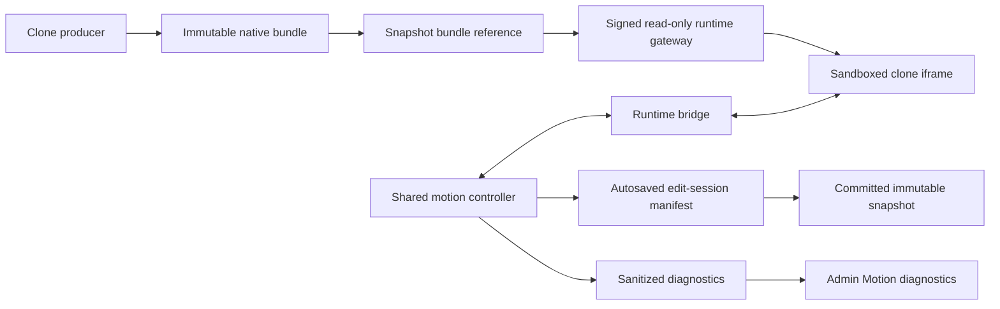

# Live Animated Clone Editing Implementation Plan

> **Status:** approved.
>
> **Date:** 2026-07-26.
>
> **Approved by:** Adilson Porto on 2026-07-26.
>
> **Design authority:** `docs/superpowers/specs/2026-07-26-live-animated-clone-editing-design.md`.
>
> **Scope of this document:** implementation sequencing, contracts, ownership boundaries, tests, rollout gates, and verification. This approval authorizes implementation in that sequence, subject to Task 0 and every explicit decision gate below.

**Goal:** Integrate the existing native motion runtime into the real Uncraft canvas so an animated clone can be edited visually, saved as immutable snapshots, restored exactly, and recovered automatically from runtime failures without exposing technical repair choices to the user.

**Architecture:** Keep the clone's original runtime inside an isolated iframe. Treat the immutable clone bundle as the source artifact, a versioned patch/control/responsive manifest as the editable state, and the existing runtime bridge as the only command surface. Extract the controller currently embedded in `NativeMotionEditor` so both the isolated motion lab and the canvas use one engine. Add a node/snapshot-scoped bundle gateway, transactional protocol, session persistence, hybrid motion settlement, ownership-aware retargeting, validated custom controls, responsive scopes, silent recovery, and sanitized diagnostics.

**Primary stack:** Next.js App Router, React, Vitest, Testing Library, PostgreSQL/Supabase-style SQL migrations, iframe `postMessage`, GSAP/ScrollTrigger/WAAPI runtime inspection, Playwright for browser smoke coverage.

---

## 1. Locked product decisions

Implementation must preserve these approved decisions without reopening them inside code review:

- Edits target the clone's real final visual state. They do not create a hidden extra animation step.
- On selection, only motion that affects the selected element is frozen and settled. The rest of the page remains unchanged.
- A finite sequence settles to its end. A loop pauses at the currently visible frame, preserves its relative movement around the edited base, and shows a loop indicator.
- Entering Preview temporarily restores the original playback state. Leaving Preview restores the frozen editing state.
- A partially visible element remains selectable. Motion settlement is allowed when at least 25% is visible or at least 32 px is meaningfully visible; a 1-2 px edge is not enough to trigger automatic movement.
- Ambiguous ownership is never guessed. The user chooses the motion channel in the Motion tab.
- Properties, Motion, and Code live in the right inspector. Assets remain in the left edit sidebar. The motion timeline is docked below the central editing viewport.
- Undo first reverses the latest user-visible transaction; repeated Undo and Redo traverse the acknowledged transactions in the current edit session. An automatic repair belongs to the transaction that caused it and never creates a separate history step.
- Direct, known, and declarative controls appear automatically. A custom-control generation action appears only when direct mapping is insufficient.
- Custom-control generation is explicit only for the first generation request. Retry, repair, and regeneration after that are automatic.
- Failed custom-control candidates never appear in the normal editor UI.
- A control that exhausts automatic recovery is disabled with the tooltip `This website doesn't support this control.` There is no user-facing Retry, Repair, or Regenerate action.
- Candidate cross-site controls remain custom controls until smoke-test evidence justifies a stronger label.
- Whether an unsupported candidate is hidden or disabled remains a smoke-test decision, not an implementation assumption.
- Unlinking a shared responsive property uses the exact blocking confirmation copy:
  - `This will set this value to desktop-only.`
  - `Cancel`
  - `Set Desktop-Only`
  - Substitute the active device name when it is not desktop.
- Reconnecting a property is immediate and applies the visible value to all devices. It has no confirmation dialog.
- Runtime and binding failures are reported automatically to `User menu > Admin > Motion diagnostics` with sanitized technical evidence.
- No failure path may require the end user to make a technical decision.

---

## 2. Current verified baseline

The implementation starts from these observed facts in the current checkout:

- `packages/web-shell/components/motion-editor/NativeMotionEditor.jsx` already contains a functional native motion lab, but it owns the controller state, message handling, history, viewport, panels, and local persistence in one large component.
- `packages/web-shell/lib/motion-editor/runtime-bridge-source.js` already inspects GSAP, ScrollTrigger, CSS, and WAAPI motion, and can apply patches inside the sandboxed clone.
- The current bridge acknowledges individual patches, but it does not provide an atomic transaction acknowledgement, grouped rollback, validation transaction, heartbeat, or automatic recovery contract.
- `packages/web-shell/app/api/native-clone/[...path]/route.js` serves one local clone selected by `UNCRAFT_NATIVE_CLONE_ROOT`. It is a development gateway, not a node-owned production bundle gateway.
- No persisted native bundle identity, bundle hash, runtime fingerprint, patch manifest, custom-control manifest, responsive manifest, or native edit session exists in `packages/web-shell/schema.sql`.
- The legacy canvas editor operates directly on same-origin `srcDoc` HTML and serializes edited HTML into a new snapshot. That path is not safe or semantically correct for native animated clones.
- `CanvasClient` already disables canvas panning during edit mode and has device controls, but its current edit framing expands a static page instead of keeping a fixed native viewport.
- `CanvasNode` already distinguishes viewport-locked animated sites from expandable static/Iter9 sites. That distinction must remain intact.
- Deferred reconstruction currently produces Iter9 HTML. Animation detection alone is therefore not proof that a node has a native editable bundle.
- There is no Admin route or admin authorization model in the current product.
- The focused native-motion and canvas-inspector baseline is green: 7 test files and 98 tests passed on 2026-07-26.

### Structural prerequisite

The first production milestone is not a panel mount. It is an immutable native bundle attached to a specific node snapshot. Until that exists, the canvas cannot safely identify which assets to serve, persist edits independently from the DOM, restore an older version, or isolate one user's runtime from another.

---

## 3. System boundaries



Ownership rules:

- The clone producer owns reconstruction fidelity and creates immutable bundle contents.
- The bundle store owns byte retrieval by opaque storage key. UI code never receives a filesystem path.
- The runtime gateway owns signed read-only access, path normalization, bridge injection, and response policy.
- The bridge owns all DOM/runtime inspection and mutation inside the isolated iframe.
- The shared controller owns editor state, transactions, undo, recovery, autosave, and panel-facing selectors.
- The canvas owns viewport placement, framing, shell layout, node selection, and entering/exiting edit mode.
- Snapshot APIs own durable commit/restore. The live DOM is never the persistence source of truth for native clones.
- Diagnostics ingestion owns sanitization and aggregation. The clone runtime never receives admin credentials or direct database access.

---

## 4. Delivery milestones

| Milestone | User-visible result | Exit gate |
|---|---|---|
| M0: Contracts and storage | No new UI | A node snapshot can identify and securely serve one immutable bundle |
| M1: Canvas vertical slice | One eligible clone opens in the native editor inside the canvas | Open, select, change direct properties, undo/redo session history, save, reload, and restore all work |
| M2: Motion correctness | Hybrid freeze, loops, preview, final-target edits, transforms, ambiguity, and responsive scope work | Runtime fixtures cover finite, looped, GSAP, CSS, WAAPI, ScrollTrigger, and mixed ownership |
| M3: Custom controls and recovery | Validated custom tweaks can be generated; failures recover automatically | No failed candidate appears; exhausted controls follow the approved disabled/hidden policy gate |
| M4: Diagnostics and evidence | Admin can inspect coverage/failures/smoke tests | Access policy is approved, data is sanitized, and smoke metrics support the universality decision |
| M5: Rollout | Feature can be enabled safely for real animated clones | Full suite, build, browser, security, accessibility, offline-runtime, and rollback checks pass |

Each milestone must remain releasable behind a flag. Do not combine all milestones into one merge.

---

## 5. Core data contracts

These names are recommended implementation contracts. Changing a field name is acceptable during implementation review, but changing the semantics requires an explicit design amendment.

### 5.1 Immutable bundle descriptor

Create a versioned descriptor similar to:

```js
{
  schemaVersion: 1,
  bundleId: 'uuid',
  storageKey: 'opaque/provider-owned-key',
  contentHash: 'sha256:...',
  entryPath: 'index.html',
  assetIndex: [{ path, contentType, byteLength, contentHash }],
  runtimeFingerprint: 'sha256:...',
  reconstructionCapabilities: {
    detectedEngines: ['gsap', 'scroll-trigger', 'waapi', 'css'],
    candidateControls: [],
  },
}
```

Constraints:

- Bundle bytes are immutable after registration.
- `storageKey` is opaque outside the store adapter.
- `entryPath` and every asset path must be relative, normalized, and contained by the bundle root.
- `contentHash` is verified at registration and may be rechecked during smoke validation.
- Candidate controls record reconstruction evidence but are not declared universal.

### 5.2 Native patch manifest

The committed snapshot stores a versioned manifest with:

```js
{
  schemaVersion: 2,
  baseBundleId: 'uuid',
  transactions: [
    {
      id: 'uuid',
      createdAt: 'ISO-8601',
      source: 'properties | motion | code | custom-control | responsive',
      patches: [],
      automaticRepairs: [],
    },
  ],
  controlManifest: {},
  responsiveManifest: {},
  runtimeFingerprint: 'sha256:...',
}
```

Constraints:

- One user gesture creates one transaction.
- A transaction is added to history only after the runtime atomically acknowledges it.
- Automatic repairs are nested inside the triggering transaction.
- A rejected transaction does not enter history or persistence.
- Legacy version-1 patches remain readable through a migration adapter.
- The manifest never contains raw page HTML, cookies, local-storage values, full text content, or executable host code.

### 5.3 Edit session

An edit session is a mutable draft anchored to one immutable base snapshot:

```js
{
  id: 'uuid',
  nodeId: 'uuid',
  userId: 'uuid',
  baseSnapshotId: 'uuid',
  draftManifest: {},
  revision: 12,
  status: 'active | committed | discarded | expired',
  updatedAt: 'ISO-8601',
}
```

Constraints:

- Autosave updates the draft with optimistic revision checking.
- Committing creates one immutable snapshot and advances `nodes.current_snapshot_id` in one database transaction.
- Discarding never mutates the base snapshot.
- A reconnect automatically resumes the existing owned server draft rather than replacing it.
- The first production release supports only one active editing controller per node. A concurrent second tab remains read-only until the active lease closes or expires; it must not merge manifests silently or ask the user to resolve a technical conflict.

### 5.4 Responsive property state

```js
{
  propertyKey: 'element-id:semantic-property',
  mode: 'shared | per-device | computed',
  sharedValue: null,
  overrides: {
    desktop: null,
    tablet: null,
    mobile: null,
  },
  provenance: 'author | inferred | runtime',
}
```

### 5.5 Custom control manifest

```js
{
  schemaVersion: 1,
  runtimeFingerprint: 'sha256:...',
  controls: [
    {
      id: 'stable-id',
      label: 'Parallax depth',
      description: 'Controls how far the layer moves relative to scroll.',
      surface: 'Motion',
      scope: 'Animation',
      affectedTargets: ['stable-target-id'],
      controlType: 'slider',
      unit: 'multiplier',
      status: 'ready | disabled',
      adapterKind: 'declarative | custom',
      binding: {},
      domain: {},
      originalValue: 1,
      compatibility: {},
      validation: {},
      failurePolicy: {},
    },
  ],
}
```

The browser UI receives only controls with `ready` or approved `disabled` status. Rejected candidates exist only in diagnostics. Every ready control must declare its surface, `Site | Group | Animation | Element` scope, every affected target, original value, safe input domain, read/write/restore/effect operations, compatibility lineage, and last successful validation. `Animation` is the default generated-motion scope; no control may silently broaden itself.

---

## 6. Implementation tasks

### Task 0: Create an implementation branch and preserve the baseline

**Purpose:** Prevent this large feature from landing as an unreviewable change and establish repeatable evidence before product edits.

**Files:**

- No product files in the first checkpoint.
- Read-only baseline evidence from `packages/web-shell`.

**Steps:**

- [ ] After this plan is approved, create a `codex/` feature branch from the intended integration branch.
- [ ] Record `git status`, branch, HEAD, Node version, package-manager version, and database migration head.
- [ ] Do not add, delete, move, or clean unrelated untracked files.
- [ ] Run the focused baseline:

  ```bash
  cd packages/web-shell
  npx vitest run \
    components/motion-editor/NativeMotionEditor.test.jsx \
    lib/motion-editor/motion-ir.test.js \
    lib/motion-editor/motion-groups.test.js \
    lib/motion-editor/native-clone-gateway.test.js \
    lib/motion-editor/protocol.test.js \
    lib/motion-editor/runtime-bridge-source.test.js \
    components/CanvasInspector.test.jsx
  ```

- [ ] Run the full `npm test` suite and record existing unrelated failures separately.
- [ ] Run `npm run build` before the first implementation commit to distinguish baseline build failures from feature regressions.
- [ ] Confirm the clone-producer owner and production bundle storage provider before Task 1 begins.

**Exit gate:** Baseline recorded, branch isolated, bundle producer owner identified, and this plan explicitly approved.

---

### Task 1: Define and validate the immutable native bundle contract

**Purpose:** Give each editable native snapshot a stable, secure source artifact before canvas integration.

**Create:**

- `packages/web-shell/lib/native-clone/bundle-contract.js`
- `packages/web-shell/lib/native-clone/bundle-contract.test.js`
- `packages/web-shell/lib/native-clone/bundle-store.js`
- `packages/web-shell/lib/native-clone/bundle-store.test.js`
- `packages/web-shell/lib/native-clone/register-bundle.js`
- `packages/web-shell/lib/native-clone/register-bundle.test.js`

**Modify only after producer ownership is confirmed:**

- `packages/web-shell/lib/deferred-reconstruction.js`
- `packages/web-shell/lib/deferred-reconstruction.test.js`
- `packages/web-shell/app/api/nodes/[id]/reconstruct/route.js`
- Its colocated route tests, creating them if missing.

**Tests first:**

- [ ] Reject a descriptor with an absolute `entryPath`.
- [ ] Reject `..`, encoded traversal, duplicate normalized paths, symlink escapes, and assets outside the declared index.
- [ ] Reject a content-hash mismatch and an unrecognized schema version.
- [ ] Prove that the store retrieves by opaque key and never exposes an OS path to route/UI callers.
- [ ] Prove that registering the same content hash is idempotent.
- [ ] Prove that registering different bytes under an existing immutable bundle ID is rejected.
- [ ] Prove that a reconstruction result marked `iter9` does not become a native bundle accidentally.
- [ ] Prove that `animatedDetected: true` without a valid bundle descriptor is still ineligible for native editing.

**Implementation:**

- [ ] Define strict parse/serialize helpers for `NativeBundleDescriptor`.
- [ ] Define a narrow `BundleStore` interface: `putImmutable`, `head`, `read`, and `listIndexedAssets`.
- [ ] Provide an in-memory/test adapter.
- [ ] Provide a development filesystem adapter that is explicitly unavailable in production.
- [ ] Add the production object-store adapter selected with the infrastructure owner. Do not silently fall back to local disk in production.
- [ ] Verify file hashes during registration and retain the reconstructed asset index.
- [ ] Add a `registerNativeBundle` boundary that takes producer output and returns only a validated descriptor.
- [ ] Extend deferred reconstruction with an explicit native result kind. Keep the current Iter9 result path unchanged.
- [ ] Preserve the approved capability-driven rule: reconstruction occurs only when a workflow needs editable runtime behavior, not merely because animation was detected.
- [ ] Record candidate global-control capabilities emitted by reconstruction as evidence, not as guaranteed controls.
- [ ] Emit the canonical candidate site-level surface and the evidence inputs required by the later isolated validator. A candidate remains pending and invisible until Task 12 validates it.

**Verification:**

- [ ] Unit tests pass with malicious path fixtures.
- [ ] One real reconstructed bundle registers, hashes, and reads without requiring `UNCRAFT_NATIVE_CLONE_ROOT`.
- [ ] Re-registering the same bundle does not duplicate storage.
- [ ] The producer/store boundary is documented in the code and handed to the producer owner.

**Exit gate:** A real clone can produce a validated immutable descriptor through a non-UI API, and Iter9/static nodes remain unchanged.

---

### Task 2: Add bundle, snapshot-manifest, and edit-session persistence

**Purpose:** Persist native edits as manifests anchored to immutable bundles instead of serializing a live DOM.

**Create:**

- `packages/web-shell/migrations/2026-07-26-native-motion-editing.sql`
- `packages/web-shell/lib/motion-editor/manifest.js`
- `packages/web-shell/lib/motion-editor/manifest.test.js`
- `packages/web-shell/lib/motion-editor/edit-session-store.js`
- `packages/web-shell/lib/motion-editor/edit-session-store.test.js`

**Modify:**

- `packages/web-shell/schema.sql`
- `packages/web-shell/app/api/nodes/[id]/snapshots/route.js`
- `packages/web-shell/app/api/nodes/[id]/snapshots/route.test.js`
- `packages/web-shell/app/api/nodes/[id]/snapshots/[snapId]/route.js`
- `packages/web-shell/app/api/nodes/[id]/snapshots/[snapId]/route.test.js`

**Recommended schema:**

- [ ] Add `native_bundles` with immutable descriptor metadata, storage key, content hash, entry path, asset index, runtime fingerprint, and timestamps.
- [ ] Add nullable native columns to `snapshots`: `native_bundle_id`, `motion_manifest`, and `motion_manifest_version`.
- [ ] Add `native_motion_edit_sessions` with owner, node, base snapshot, draft manifest, optimistic revision, status, and timestamps.
- [ ] Add a uniqueness rule for one active session per node.
- [ ] Add foreign-key and delete rules that cannot orphan a committed snapshot's bundle.
- [ ] Leave legacy `html`, `design_md`, and screenshot fields untouched for static/Iter9 snapshots.

**Tests first:**

- [ ] Round-trip an empty version-2 manifest.
- [ ] Read a version-1 patch list through a deterministic compatibility adapter.
- [ ] Reject a manifest whose `baseBundleId` differs from its snapshot.
- [ ] Reject unknown patch/control kinds rather than applying them loosely.
- [ ] Create an edit session only for a node owned by the current user.
- [ ] Reject stale draft writes with the previous revision number.
- [ ] Prove one active session per node.
- [ ] Prove legacy snapshot list/restore payloads remain backward-compatible.

**Implementation:**

- [ ] Implement schema validation and normalization without executing adapter code.
- [ ] Add transactional store helpers for open/resume, update draft, commit, discard, expire, and read-only conflict detection.
- [ ] Return native bundle/manifest metadata from snapshot APIs only when present.
- [ ] Keep the existing legacy `save-edit` route unchanged in this task.
- [ ] Add indexes for node/session lookups and bundle hashes.
- [ ] Add migration rollback notes, but do not write a destructive automatic down migration.

**Verification:**

- [ ] Apply the migration to a disposable database.
- [ ] Exercise a legacy node and a native node through list/restore APIs.
- [ ] Confirm a committed snapshot remains readable after its draft session is discarded.

**Exit gate:** Native bundle identity and immutable manifests can coexist with every existing snapshot type.

---

### Task 3: Replace the development-only clone path with a signed, node-scoped runtime gateway

**Purpose:** Serve exactly one authorized bundle to one sandboxed editing session without exposing app credentials or filesystem paths.

**Create:**

- `packages/web-shell/lib/motion-editor/runtime-session-token.js`
- `packages/web-shell/lib/motion-editor/runtime-session-token.test.js`
- `packages/web-shell/app/api/nodes/[id]/runtime-session/route.js`
- `packages/web-shell/app/api/nodes/[id]/runtime-session/route.test.js`
- `packages/web-shell/app/api/runtime/[token]/[...path]/route.js`
- `packages/web-shell/app/api/runtime/[token]/[...path]/route.test.js`

**Modify:**

- `packages/web-shell/lib/motion-editor/native-clone-gateway.js`
- `packages/web-shell/lib/motion-editor/native-clone-gateway.test.js`
- `packages/web-shell/app/api/native-clone/[...path]/route.js`
- `packages/web-shell/app/api/native-clone/[...path]/route.test.js`

**Tests first:**

- [ ] Only the node owner can create a runtime session.
- [ ] A runtime token is short-lived, read-only, and scoped to one bundle and one entry prefix.
- [ ] Runtime tokens use a dedicated signing secret/key and are not valid as Uncraft login/session tokens.
- [ ] An expired, altered, cross-node, or cross-bundle token returns an inert error response.
- [ ] Path traversal, encoded traversal, null bytes, path confusion, and undeclared assets are rejected.
- [ ] Root-relative, relative, `srcset`, stylesheet, module, and dynamic asset paths resolve within the signed runtime prefix.
- [ ] HTML receives the bridge exactly once.
- [ ] Non-HTML assets are never modified.
- [ ] The runtime response does not depend on the main app session cookie.
- [ ] Production runtime requests occur on an isolated runtime origin to which Uncraft authentication cookies are never scoped.
- [ ] The gateway sets a restrictive CSP and sandbox-compatible headers.
- [ ] A bundle cannot call privileged app APIs through inherited runtime credentials.

**Implementation:**

- [ ] Sign a compact token containing bundle ID, session ID, expiry, and nonce with a dedicated runtime-session key. Do not reuse `JWT_SECRET` and do not place the provider storage key in the URL.
- [ ] Resolve token to bundle metadata server-side and read only from the bundle store.
- [ ] Parameterize `rewriteRuntimePaths` with the signed runtime base instead of hardcoding `/api/native-clone`.
- [ ] Continue to expose `/api/native-clone` only as the explicit local motion-lab adapter.
- [ ] Serve production runtimes from a dedicated runtime origin with no Uncraft auth-cookie scope. The same-host signed route is allowed only for local development/tests and must ignore ambient cookies.
- [ ] Inject the version-negotiating bridge, initial manifest, runtime fingerprint, and session nonce.
- [ ] Add cache headers keyed by immutable bundle hash for assets and no-store for token-bearing HTML.
- [ ] Set `Referrer-Policy: no-referrer` on token-bearing runtime responses and avoid logging full signed URLs.
- [ ] Return a non-technical load failure to the host while recording the technical reason in diagnostics.

**Verification:**

- [ ] Open two different bundles concurrently and prove their assets cannot cross-resolve.
- [ ] Block non-local network requests during a fixture test and prove the reconstructed clone remains fully functional from its bundle.
- [ ] Confirm that the exact iframe opening flow works without `file://` and without the development environment variable.

**Exit gate:** A snapshot can obtain a secure runtime URL and load its complete clone independently from the developer-only gateway, with the isolated production runtime origin configured before production exposure.

---

### Task 4: Introduce protocol v2 with negotiation, atomic transactions, validation, and health

**Purpose:** Make the runtime bridge reliable enough for autosave, undo, automatic repair, and custom-control validation.

**Modify:**

- `packages/web-shell/lib/motion-editor/protocol.js`
- `packages/web-shell/lib/motion-editor/protocol.test.js`
- `packages/web-shell/lib/motion-editor/runtime-bridge-source.js`
- `packages/web-shell/lib/motion-editor/runtime-bridge-source.test.js`
- `packages/web-shell/components/motion-editor/NativeMotionEditor.jsx`
- `packages/web-shell/components/motion-editor/NativeMotionEditor.test.jsx`

**Create:**

- `packages/web-shell/lib/motion-editor/transaction.js`
- `packages/web-shell/lib/motion-editor/transaction.test.js`

**Tests first:**

- [ ] A v1 lab client and a v2-capable runtime can negotiate without breaking existing fixtures.
- [ ] Every command/response has a session nonce, request ID, and explicit supported protocol version.
- [ ] A multi-patch transaction either commits fully or restores every affected property.
- [ ] A continuous gesture captures `before` exactly once, applies bounded live preview updates, validates once at gesture end, and records one `after` value.
- [ ] Canceling or failing a live gesture restores `before`, creates no history entry, and schedules no autosave.
- [ ] Runtime-originated values may refresh a visible control without creating history.
- [ ] The host adds history only after `transaction-committed`.
- [ ] A rejected transaction reports a stable error code, not raw exception text, and does not enter history.
- [ ] Duplicate request IDs are idempotent.
- [ ] Out-of-order acknowledgements cannot reorder user transactions.
- [ ] A validation transaction can inspect, apply, observe, and restore without entering history.
- [ ] Heartbeat timeout is detectable and a new handshake invalidates commands from the old runtime instance.
- [ ] Messages from another window, origin, bundle, nonce, or session are ignored.

**Implementation:**

- [ ] Add version negotiation to `runtime-ready` while accepting the existing v1 envelope during migration.
- [ ] Add atomic `apply-transaction`, `rollback-transaction`, and `validate-transaction` commands.
- [ ] Add a bounded gesture-preview lifecycle: begin with captured `before`, coalesced preview updates, commit after validation, and cancel/restore.
- [ ] Add `transaction-committed`, `transaction-rejected`, `validation-result`, `heartbeat`, and `runtime-health` events.
- [ ] Capture all `before` values in the bridge before applying the first patch.
- [ ] Roll back in reverse mutation order if any patch fails.
- [ ] Keep diagnostic details in a sanitized nested payload, separate from the stable UI-facing error code.
- [ ] Add message size, patch-count, and execution-time bounds.
- [ ] Add a runtime generation number so late events from a reloaded iframe cannot mutate current controller state.

**Verification:**

- [ ] Fault-inject a failure in the middle of a three-patch transaction and compare the DOM/runtime state byte-for-byte for affected values.
- [ ] Reload the iframe during a transaction and confirm the controller recovers or rejects without partial persistence.
- [ ] Re-run every current protocol and runtime-bridge test.

**Exit gate:** The host can trust one acknowledged transaction as the unit of save, undo, and repair.

---

### Task 5: Extract one reusable native motion controller while preserving the isolated lab

**Purpose:** Reuse the proven motion engine rather than implementing a second canvas-specific editor.

**Create:**

- `packages/web-shell/components/motion-editor/useNativeMotionController.js`
- `packages/web-shell/components/motion-editor/useNativeMotionController.test.jsx`
- `packages/web-shell/lib/motion-editor/session-history.js`
- `packages/web-shell/lib/motion-editor/session-history.test.js`
- `packages/web-shell/lib/motion-editor/devices.js`
- `packages/web-shell/lib/motion-editor/devices.test.js`

**Modify:**

- `packages/web-shell/components/motion-editor/NativeMotionEditor.jsx`
- `packages/web-shell/components/motion-editor/NativeMotionEditor.test.jsx`
- `packages/web-shell/app/motion-editor/page.jsx`

**Tests first:**

- [ ] The extracted controller reproduces current selection, patch, viewport inspection, timeline, and playback behavior in the isolated lab.
- [ ] History contains only acknowledged user transactions from the current edit session.
- [ ] Undo first reverses the latest transaction and can continue backward through the current session.
- [ ] Redo reapplies undone session transactions in chronological order.
- [ ] A new acknowledged change after Undo clears only the abandoned redo branch.
- [ ] Automatic repairs remain nested in the triggering transaction.
- [ ] Switching device does not create an undo entry by itself.
- [ ] Controller teardown removes listeners and rejects late bridge events.
- [ ] Two controllers on the same page cannot receive each other's messages.

**Implementation:**

- [ ] Move bridge connection, runtime status, selection, transaction queue, session undo/redo, device state, timeline state, and recovery state into the hook.
- [ ] Expose small command methods and derived selectors instead of returning raw setters.
- [ ] Keep layout state outside the controller.
- [ ] Move device dimensions into one shared configuration. Use the existing canvas editing dimensions as the initial canonical values: desktop `1280x800`, tablet `768x920`, mobile `390x844`.
- [ ] Make persistence pluggable: the isolated lab uses its current local adapter; the canvas will use the server edit-session adapter.
- [ ] Convert `NativeMotionEditor` into a layout wrapper around the shared controller without changing its route or deleting its tests.
- [ ] Keep localStorage only in the isolated lab adapter. Canvas sessions must never use localStorage as the authoritative manifest.

**Verification:**

- [ ] Run the isolated motion lab before and after extraction and compare its main flows.
- [ ] Run component tests under React strict mode to catch duplicate listener registration.
- [ ] Confirm there is one protocol implementation and one runtime bridge, not canvas forks.

**Exit gate:** The isolated lab remains green and the shared controller can be mounted with a caller-supplied runtime URL and persistence adapter.

---

### Task 6: Route eligible nodes to a native fixed-viewport canvas editor

**Purpose:** Mount the shared controller at the canvas boundary without disturbing the legacy static/Iter9 editor.

**Create:**

- `packages/web-shell/lib/node-editor-kind.js`
- `packages/web-shell/lib/node-editor-kind.test.js`
- `packages/web-shell/components/motion-editor/NativeEditViewport.jsx`
- `packages/web-shell/components/motion-editor/NativeEditViewport.test.jsx`
- `packages/web-shell/components/CanvasNode.test.jsx`

**Modify:**

- `packages/web-shell/components/CanvasClient.jsx`
- `packages/web-shell/components/CanvasNodeItem.jsx`
- `packages/web-shell/components/CanvasNode.jsx`
- `packages/web-shell/app/canvas/[boardId]/page.jsx`
- `packages/web-shell/lib/node-viewport.js`
- `packages/web-shell/lib/node-viewport.test.js`

**Tests first:**

- [ ] A snapshot with a valid native bundle and supported manifest routes to `NativeEditViewport`.
- [ ] A static node routes to the current legacy editor.
- [ ] An Iter9 node routes to the current legacy editor.
- [ ] An animated-detected node without a native bundle does not route to the native editor.
- [ ] Entering native edit mode disables canvas pan and zoom gestures without disabling scroll inside the clone.
- [ ] The node uses a fixed canonical device viewport and does not expand to full document height.
- [ ] Exiting native edit restores the node geometry and camera state expected by the canvas.
- [ ] Selection and edit mode remain node-scoped when more than one native node exists.
- [ ] Selection overlays remain clipped to the website viewport and application panels never count as website visibility or selection area.

**Implementation:**

- [ ] Add a pure `resolveNodeEditorKind(node, snapshot, flags)` function.
- [ ] Include only the native snapshot eligibility metadata needed by `resolveNodeEditorKind` in the board's initial node query; fetch the full manifest through the owned edit-session API when Edit opens.
- [ ] Gate the new path behind `NEXT_PUBLIC_NATIVE_MOTION_CANVAS_EDIT` and the presence of a validated native bundle.
- [ ] Ask the server for a short-lived runtime URL when edit mode opens.
- [ ] Mount `NativeEditViewport` only for the eligible branch.
- [ ] Preserve `CanvasEditorCore` for static and Iter9 nodes.
- [ ] Add native-specific edit framing that centers the fixed device rectangle in the free canvas area without measuring full page height.
- [ ] Keep canvas panning disabled while editing and route wheel/touch scroll to the iframe when the pointer is over the site.
- [ ] Restore the previous node dimensions and canvas transform on Done, Cancel, node deletion, route change, and unexpected runtime teardown.
- [ ] If the runtime session cannot open, leave the node visually intact, exit the half-open edit state automatically, show a non-technical failure, and emit diagnostics.

**Verification:**

- [ ] Open a legacy node, an Iter9 node, and a native node in the same board.
- [ ] Enter and exit each editor twice and confirm no geometry or event-listener leak.
- [ ] Test mouse wheel, trackpad, touch, Escape, browser resize, and device switching.

**Exit gate:** One native clone can open safely inside the real canvas while every existing editor path remains unchanged.

---

### Task 7: Build the native edit shell around the shared controller

**Purpose:** Place the approved editing surfaces in the real canvas chrome.

**Create:**

- `packages/web-shell/components/motion-editor/NativeEditSidebar.jsx`
- `packages/web-shell/components/motion-editor/NativeEditSidebar.test.jsx`
- `packages/web-shell/components/motion-editor/NativeMotionInspector.jsx`
- `packages/web-shell/components/motion-editor/NativeMotionInspector.test.jsx`
- `packages/web-shell/components/motion-editor/NativeMotionTimelineDock.jsx`
- `packages/web-shell/components/motion-editor/NativeMotionTimelineDock.test.jsx`
- `packages/web-shell/components/motion-editor/NativeMotionEditChrome.jsx`
- `packages/web-shell/components/motion-editor/native-motion-canvas.module.css`

**Modify:**

- `packages/web-shell/components/motion-editor/NativeMotionEditor.jsx`
- `packages/web-shell/components/motion-editor/native-motion-editor.module.css`
- `packages/web-shell/components/CanvasClient.jsx`
- `packages/web-shell/components/CanvasInspector.jsx`
- `packages/web-shell/components/CanvasInspector.test.jsx`

**Tests first:**

- [ ] Resting canvas inspection still shows the current non-edit inspector.
- [ ] Native edit mode shows Properties, Motion, and Code in the right inspector.
- [ ] Assets appear in the left edit sidebar, not in the right inspector.
- [ ] The timeline is docked below the central viewport and never overlaps either side panel.
- [ ] The timeline appears only when the current selection or page context has motion to show.
- [ ] Selecting a website element synchronizes the overlay, Properties target, Motion target, and timeline rows.
- [ ] Selecting a timeline row may scroll/frame the target only when the meaningful-visibility rule permits automatic movement.
- [ ] The contextual top bar retains Cancel, Done, device controls, Undo, and Redo.
- [ ] Panels remain fixed while the clone scrolls.
- [ ] Device controls and Done/Cancel remain reachable at supported window sizes.
- [ ] The shell is keyboard navigable and uses correct tab, tabpanel, dialog, and toolbar semantics.
- [ ] No native panel mounts for legacy editors.

**Implementation:**

- [ ] Extract or export the current Properties, Motion, Code, Assets, and timeline views from the isolated editor in small steps.
- [ ] Keep all panels bound to selectors/actions from the shared controller.
- [ ] Mount chrome at the canvas application layer, not inside the transformed node world.
- [ ] Reserve left, right, and bottom regions when computing native edit framing.
- [ ] Keep the existing adaptive shell rules: contextual inspector, edit-specific left panel, and no permanent global Preview/Navigator resurrection.
- [ ] Keep application chrome visually independent from the clone; editor state must never rewrite the cloned site's own colors.
- [ ] Make selection in Layers/Sections drive bridge selection by stable element ID; do not access iframe DOM directly.
- [ ] Preserve current empty, loading, no-selection, and runtime-unavailable states in non-technical language.

**Verification:**

- [ ] Capture screenshots at desktop, tablet, mobile device modes and narrow host-window widths.
- [ ] Compare the isolated lab and canvas panels for behavioral parity.
- [ ] Verify no panel CSS leaks into the canvas or clone iframe.

**Exit gate:** The approved shell hierarchy exists in the canvas and uses the same controller as the isolated lab.

---

### Task 8: Implement server-backed draft autosave, commit, restore, discard, and session undo/redo

**Purpose:** Make every native edit durable without treating the live DOM as the saved artifact.

**Create:**

- `packages/web-shell/lib/motion-editor/native-edit-api.js`
- `packages/web-shell/lib/motion-editor/native-edit-api.test.js`
- `packages/web-shell/app/api/nodes/[id]/motion-session/route.js`
- `packages/web-shell/app/api/nodes/[id]/motion-session/route.test.js`
- `packages/web-shell/app/api/nodes/[id]/motion-session/commit/route.js`
- `packages/web-shell/app/api/nodes/[id]/motion-session/commit/route.test.js`
- `packages/web-shell/app/api/nodes/[id]/motion-session/discard/route.js`
- `packages/web-shell/app/api/nodes/[id]/motion-session/discard/route.test.js`

**Modify:**

- `packages/web-shell/components/motion-editor/useNativeMotionController.js`
- `packages/web-shell/components/motion-editor/useNativeMotionController.test.jsx`
- `packages/web-shell/components/CanvasClient.jsx`
- `packages/web-shell/lib/canvas-api.js`

**Tests first:**

- [ ] Opening an eligible node creates or resumes one owned active session at its current snapshot.
- [ ] An acknowledged transaction updates the local draft immediately and schedules a debounced server write.
- [ ] A continuous slider/curve gesture previews live values but persists one transaction only when the gesture ends successfully.
- [ ] Autosave writes are monotonic by revision and survive out-of-order network responses.
- [ ] An autosave failure does not discard the local draft and retries automatically with bounded backoff.
- [ ] Commit flushes the latest draft, creates one immutable snapshot, advances the node pointer, and closes the session atomically.
- [ ] `Save version` creates an immutable snapshot from the latest valid manifest and continues editing from that new base.
- [ ] A significant structural operation first creates an immutable snapshot from the latest valid manifest.
- [ ] Discard leaves the current snapshot unchanged.
- [ ] Snapshot restore loads the snapshot's base bundle and manifest, not captured live HTML.
- [ ] Undo applies the inverse of the latest committed session transaction, waits for runtime acknowledgement, updates the draft, and advances the history cursor.
- [ ] Repeated Undo traverses earlier acknowledged transactions in the same editing session.
- [ ] Redo reapplies undone transactions in chronological order and updates the draft only after acknowledgement.
- [ ] A failed Undo or Redo restores its pre-operation controller/history state and emits diagnostics.
- [ ] Automatic repair patches undo and redo together with their initiating user transaction.
- [ ] A runtime-originated control refresh updates visible state without adding history or autosave.

**Implementation:**

- [ ] Create a server persistence adapter for the shared controller.
- [ ] Use a short debounce for draft writes, but flush on Done, Preview, device-scope changes, visibility loss, navigation, and structural operations.
- [ ] Keep unsent local revisions until the server confirms them.
- [ ] Make Done commit and exit. Make Cancel discard the current session and restore the base snapshot.
- [ ] Support a commit reason of `exit`, `save-version`, or `before-structural-operation`; only `exit` closes Edit.
- [ ] Keep the current legacy `save-edit` HTML route for legacy editors only.
- [ ] Update the canvas node's current snapshot in local state after native commit.
- [ ] Revoke the runtime token and release runtime resources when a session closes.
- [ ] End the undo/redo stack when Edit ends. Earlier immutable states remain available through version history rather than cross-session Undo.

**Verification:**

- [ ] Make an edit, reload the browser before Done, resume the draft, then commit.
- [ ] Disconnect the server after a local transaction, reconnect, and confirm automatic autosave convergence.
- [ ] Commit two snapshots, restore the first, and compare runtime output at the same device and scroll state.

**Exit gate:** The M1 vertical slice passes: open, select, make multiple changes, undo and redo them in session order, save, reload, and restore.

---

### Task 9: Implement the hybrid freeze, settlement, loop, and Preview state machine

**Purpose:** Make animated elements stable to edit while preserving the rest of the site's live behavior.

**Create:**

- `packages/web-shell/lib/motion-editor/edit-state-machine.js`
- `packages/web-shell/lib/motion-editor/edit-state-machine.test.js`
- `packages/web-shell/lib/motion-editor/visibility.js`
- `packages/web-shell/lib/motion-editor/visibility.test.js`
- `packages/web-shell/lib/motion-editor/settlement.js`
- `packages/web-shell/lib/motion-editor/settlement.test.js`

**Modify:**

- `packages/web-shell/lib/motion-editor/runtime-bridge-source.js`
- `packages/web-shell/lib/motion-editor/runtime-bridge-source.test.js`
- `packages/web-shell/components/motion-editor/useNativeMotionController.js`
- `packages/web-shell/components/motion-editor/NativeMotionInspector.jsx`
- `packages/web-shell/components/motion-editor/NativeEditViewport.jsx`

**Tests first:**

- [ ] Direct click can select any visible portion of an element.
- [ ] Navigate keeps normal scrolling, scroll-driven motion, pointer/media/runtime interactions, and all confirmed manifest edits live.
- [ ] Scrolling into Navigate never discards the current draft manifest.
- [ ] When scrolling settles, the state machine returns to Frozen and evaluates the selected element for scoped settlement.
- [ ] Automatic settlement starts only when visible ratio is at least 0.25 or the centralized meaningful-visibility helper accepts at least 32 px of visible intersection.
- [ ] A 1-2 px sliver of an otherwise offscreen element never causes settlement or viewport movement.
- [ ] A finite GSAP/WAAPI/CSS sequence settles to its final state and pauses only writers affecting the selected element.
- [ ] A chain of finite animations settles to the final state of the effective chain.
- [ ] A repeating animation pauses at the currently visible frame and reports a loop indicator without jumping to an invented start or final frame.
- [ ] ScrollTrigger settlement evaluates the selected element's relevant final editable state without jumping the outer canvas.
- [ ] Switching selection restores the previous element's pre-edit playback state before settling the new selection.
- [ ] Preview restores the captured original playback/scroll state for the whole page.
- [ ] Preview temporarily removes selection and editing chrome while keeping the current unsnapshotted manifest applied.
- [ ] Leaving Preview restores the selected element's frozen editing state.
- [ ] Scrub updates the frame continuously while dragging, freezes again on release, creates no keyframe by itself, and keeps confirmed edits.
- [ ] Play, pause, Preview, and scrub remain non-persistent editor commands and never become node patches by themselves.
- [ ] Exiting edit mode releases all freezes and observers.

**Implementation:**

- [ ] Represent editor states explicitly: `navigating`, `selection-pending`, `settling`, `editing-frozen`, `scrubbing`, `previewing`, `recovering`, and `unavailable`.
- [ ] Define the 32 px geometric interpretation once in `visibility.js`, document it with boundary fixtures, and require it to reject 1-2 px slivers before canvas integration.
- [ ] Capture a scoped playback snapshot before settlement, including animation time/progress, paused state, scroll position, and relevant trigger state.
- [ ] Enumerate only animation writers that can affect the selected element or its inherited/composed presentation.
- [ ] For finite sequences, settle safely without firing destructive callbacks when the runtime API supports suppression.
- [ ] For loops, capture and freeze the currently visible normalized progress. Scrub may choose another point, but selection itself never invents one.
- [ ] Apply loop edits to the loop's base state while preserving its relative movement.
- [ ] Keep unrelated animations and page interactions untouched.
- [ ] Expose a loop badge/indicator in Motion without asking the user to choose a frame.
- [ ] Show `Loop` beside the timeline row and in the selected Motion header, never as a badge over the canvas element.
- [ ] Make settlement idempotent across duplicate selection events.
- [ ] Add time bounds. If settlement cannot complete, keep selection usable, disable only the affected control path, and start automatic recovery.

**Verification:**

- [ ] Build fixtures for finite entrance, infinite loop, ScrollTrigger, CSS keyframes, WAAPI, nested animation, and mixed engines.
- [ ] Compare unrelated animations before/during selected settlement.
- [ ] Repeat select/preview/edit cycles at different scroll positions.

**Exit gate:** Editing is visually stable, Preview is reversible, and no unrelated page motion is frozen.

---

### Task 10: Add motion ownership analysis, final-target retargeting, transform decomposition, and ambiguity UI

**Purpose:** Change the existing animation's intended final value instead of adding an invisible override or guessing the wrong writer.

**Create:**

- `packages/web-shell/lib/motion-editor/motion-ownership.js`
- `packages/web-shell/lib/motion-editor/motion-ownership.test.js`
- `packages/web-shell/lib/motion-editor/retarget-patch.js`
- `packages/web-shell/lib/motion-editor/retarget-patch.test.js`
- `packages/web-shell/lib/motion-editor/transform-components.js`
- `packages/web-shell/lib/motion-editor/transform-components.test.js`
- `packages/web-shell/components/motion-editor/MotionOwnershipChoice.jsx`
- `packages/web-shell/components/motion-editor/MotionOwnershipChoice.test.jsx`

**Modify:**

- `packages/web-shell/lib/motion-editor/motion-ir.js`
- `packages/web-shell/lib/motion-editor/motion-ir.test.js`
- `packages/web-shell/lib/motion-editor/runtime-bridge-source.js`
- `packages/web-shell/lib/motion-editor/runtime-bridge-source.test.js`
- `packages/web-shell/components/motion-editor/NativeMotionInspector.jsx`
- `packages/web-shell/components/motion-editor/useNativeMotionController.js`

**Tests first:**

- [ ] A property owned by one finite animation retargets that animation's final value.
- [ ] A Properties retarget preserves the source state, duration, easing, path, loop behavior, and timeline structure unless the user changes them explicitly in Motion.
- [ ] Timing, easing/curves, playback, loop/ping-pong, tracks, timeline structure, explicit keyframes, and animation/group-specific controls mutate only through Motion actions.
- [ ] When sequential writers affect a property, retarget the last writer that determines the resting value and preserve earlier tracks.
- [ ] A parent timeline that only schedules a writing child is not reported as the property owner.
- [ ] A property not owned by motion uses a direct style/declarative patch.
- [ ] A keyframe patch is never created merely because the playhead is not at zero.
- [ ] Two independent writers for the same semantic property produce an ambiguity result.
- [ ] The Motion tab lists human-readable channels and refuses to apply until one is chosen.
- [ ] The Properties field shows the calculated visual value, indicates multiple controlling motions, and opens Motion with only contributors highlighted.
- [ ] Contributor labels describe visible behavior such as `Entrance` or `Hover`, not runtime IDs.
- [ ] The selected ownership channel persists in the manifest.
- [ ] Translate X, translate Y, scale X/Y, rotate, skew, and transform-origin remain independently editable where decomposition is reliable.
- [ ] Complex 3D/procedural transform cases that cannot be decomposed safely do not masquerade as standard position/rotation fields; they appear in Motion only through a validated specific control, with Code Only as the final classification when no safe binding exists.
- [ ] Relative values, staggered targets, and function-based GSAP values preserve runtime semantics when supported.

**Implementation:**

- [ ] Add a bridge inspection response that enumerates candidate writers in execution/composition order.
- [ ] Normalize DOM/CSS/GSAP/WAAPI writers into semantic property channels.
- [ ] Resolve ownership through scheduling containers to the animation that actually writes the value.
- [ ] Add version-2 retarget patches that identify runtime engine, animation ID, target, keyframe/end value, and responsive scope.
- [ ] Resolve one safe owner automatically.
- [ ] Return an explicit ambiguity model when more than one plausible owner exists.
- [ ] Render ambiguity only in Motion, with no modal interruption.
- [ ] Add the Properties-side multiple-motion indicator and route its activation to the filtered Motion contributors.
- [ ] Store the user's channel choice so later edits and restore use the same target.
- [ ] Decompose transforms into semantic components while preserving unedited components and transform order.
- [ ] Assign editability levels `direct`, `known`, `declarative`, `custom`, or `code`.

**Verification:**

- [ ] Inspect the resulting animation after reload and confirm its final keyframe/target changed rather than a new override being appended.
- [ ] Scrub before and after the changed target to verify interpolation remains coherent.
- [ ] Exercise ambiguous and non-decomposable fixtures and confirm no invented position appears.

**Exit gate:** Core motion properties edit the true animation target, and ambiguous ownership is explicit and safe.

---

### Task 11: Implement shared, per-device, and computed responsive property scopes

**Purpose:** Make every field reveal and control its device reach without duplicating an entire editing mode.

**Create:**

- `packages/web-shell/lib/motion-editor/responsive-manifest.js`
- `packages/web-shell/lib/motion-editor/responsive-manifest.test.js`
- `packages/web-shell/components/motion-editor/PropertyScopeButton.jsx`
- `packages/web-shell/components/motion-editor/PropertyScopeButton.test.jsx`
- `packages/web-shell/components/motion-editor/MotionDeviceScopeDialog.jsx`
- `packages/web-shell/components/motion-editor/MotionDeviceScopeDialog.test.jsx`

**Modify:**

- `packages/web-shell/components/motion-editor/NativeMotionInspector.jsx`
- `packages/web-shell/components/motion-editor/useNativeMotionController.js`
- `packages/web-shell/components/motion-editor/native-motion-canvas.module.css`
- `packages/web-shell/lib/motion-editor/manifest.js`

**Tests first:**

- [ ] A shared property displays a connected-chain icon and affects all devices.
- [ ] The connected-chain tooltip reads exactly `Applied to all devices`.
- [ ] Activating the connected-chain control opens a centered blocking dialog.
- [ ] Desktop exact copy is `This will set this value to desktop-only.`, `Cancel`, and `Set Desktop-Only`.
- [ ] Tablet and mobile substitute only the device name.
- [ ] Cancel closes the dialog and changes nothing.
- [ ] Confirm creates an override for only the active device using the currently visible value.
- [ ] An unlinked property displays a broken-chain icon.
- [ ] Activating the broken-chain icon reconnects immediately, shows no dialog, applies the visible value to desktop, tablet, and mobile, and removes the property's device-specific variations.
- [ ] A computed property communicates that the current runtime decides its value and disables invalid scope actions.
- [ ] The inspector shows only fields relevant to the active device; device-only fields from other viewports are not mixed in.
- [ ] The device switcher may indicate that overrides exist without displaying another device's fields.
- [ ] Settlement is measured independently per device rather than reusing desktop animation state on tablet/mobile.
- [ ] The dialog traps focus, closes on Escape as Cancel, returns focus to the chain button, and is announced by assistive technology.

**Implementation:**

- [ ] Add responsive scope to every property-facing controller selector.
- [ ] Keep one base/shared value and sparse per-device overrides in the manifest.
- [ ] Resolve the effective value deterministically for the active device.
- [ ] Use an icon button with accessible name; do not add an `All devices` tag.
- [ ] Mount the confirmation at the application layer above the editing shell.
- [ ] Treat unlink and reconnect as normal user transactions in the current session undo/redo history.
- [ ] Flush autosave immediately after a confirmed scope change.
- [ ] Ensure changing the active device does not silently alter scope.

**Verification:**

- [ ] Edit one property through shared, desktop-only, reconnect, tablet-only, save, reload, and snapshot restore.
- [ ] Inspect behavior at all three canonical viewport sizes.

**Exit gate:** Device reach is visible per field and the approved confirmation behavior is exact.

---

### Task 12: Implement the control ladder and validated custom-control generation

**Purpose:** Offer direct controls where reliable, generate custom controls only when needed, and never show a failed binding.

**Decision gate before model calls:** Approve the model/provider, maximum cost, billing/credit treatment, retention policy, and timeout budget for one explicit Generate controls request. Do not wire a paid model call until this is decided.

**Create:**

- `packages/web-shell/lib/motion-editor/control-manifest.js`
- `packages/web-shell/lib/motion-editor/control-manifest.test.js`
- `packages/web-shell/lib/motion-editor/control-capabilities.js`
- `packages/web-shell/lib/motion-editor/control-capabilities.test.js`
- `packages/web-shell/lib/motion-editor/control-generation.js`
- `packages/web-shell/lib/motion-editor/control-generation.test.js`
- `packages/web-shell/app/api/nodes/[id]/motion-controls/generate/route.js`
- `packages/web-shell/app/api/nodes/[id]/motion-controls/generate/route.test.js`
- `packages/web-shell/components/motion-editor/CustomControlsSection.jsx`
- `packages/web-shell/components/motion-editor/CustomControlsSection.test.jsx`

**Modify:**

- `packages/web-shell/lib/motion-editor/motion-ir.js`
- `packages/web-shell/lib/motion-editor/runtime-bridge-source.js`
- `packages/web-shell/lib/motion-editor/runtime-bridge-source.test.js`
- `packages/web-shell/components/motion-editor/NativeMotionInspector.jsx`
- `packages/web-shell/components/motion-editor/useNativeMotionController.js`

**Tests first:**

- [ ] Direct mappings appear automatically without generation.
- [ ] Known-library and declarative controls appear automatically only when their bindings validate.
- [ ] The explicit generation action appears only when useful editability remains and direct mapping is insufficient.
- [ ] One request normally proposes approximately three useful controls and never exposes more than five per animation or group.
- [ ] Generated controls default to `Animation` scope; Group or Site scope is accepted only when every affected target/capability is declared and validated.
- [ ] The initial catalog accepts only slider plus numeric entry, toggle, curated select, curated color, and the existing easing curve.
- [ ] Free text, arbitrary color expressions, code, JSON, arrays, and arbitrary objects are rejected from the primary control catalog.
- [ ] Every ready control has a concise label, one-line explanation, familiar unit, curated range/step/options, current runtime value, original compatible-clone value, and `Reset to original`.
- [ ] `Default` and Reset use the compatible clone's original value, not the latest saved snapshot value.
- [ ] A control that cannot reliably read `before` never displays an invented value or enables a mutation that cannot be undone.
- [ ] Every candidate runs inspection, reversible application, visible-effect measurement, restore, reapply, and final restore before becoming ready.
- [ ] Validation rejects writes outside declared targets, unexpected global side effects, non-deterministic repeated input, leaked listeners/observers, and incomplete restoration.
- [ ] Validation rejects runtime exceptions, layout breakage, loss of interaction/animation fidelity, and unstable useful ranges.
- [ ] Sliders validate representative points across the safe range; every curated select option and preset validates.
- [ ] Canvas, shader, and other visually rendered effects use a localized visual oracle when runtime/computed state cannot prove an effect.
- [ ] A candidate with no visible effect is rejected silently from the editor UI.
- [ ] A candidate that throws, escapes its declared target, fails restore, or mismatches the runtime fingerprint is rejected silently.
- [ ] Accepted controls persist with stable IDs and reload without another model call.
- [ ] A compatible descendant snapshot retains the stable control ID after semantic-target and binding revalidation.
- [ ] An unrelated text/style change does not invalidate a control merely because the complete site hash changed.
- [ ] Subsequent repair/regeneration attempts happen automatically and do not show user choices.
- [ ] A custom adapter executes only inside the sandboxed runtime with a narrow capability API.
- [ ] Host UI code never evaluates generated adapter source.

**Implementation:**

- [ ] Render the ladder in order: Direct, Known Library, Declarative Adapter, Custom Adapter, Code Only.
- [ ] Treat `Code Only` as the last current classification, not a permanent claim that the animation can never be edited.
- [ ] Prefer bindings in this order when they satisfy the full contract: CSS custom property, declarative DOM attribute, known runtime binding, typed protocol command, then custom sandbox adapter.
- [ ] Keep visual values in Properties and motion behavior in Motion regardless of binding kind.
- [ ] Implement only slider plus numeric entry, toggle, curated select, curated color, and the existing easing curve in the initial catalog.
- [ ] Add `Reset to original` to every exposed control using the original value from the compatible clone version.
- [ ] Define a declarative binding grammar before allowing custom code.
- [ ] Let reconstruction precompute candidate capabilities, but validate them against the exact runtime fingerprint before rendering.
- [ ] Connect the isolated validator to the reconstruction pipeline so candidate site-level capabilities are instrumented and validated before they can appear when Edit opens.
- [ ] Send only the minimum structural/motion evidence needed for generation. Exclude user credentials, cookies, localStorage, and unrelated page text.
- [ ] Run generated adapters inside the already sandboxed clone through a restricted adapter registry.
- [ ] Enforce target, property, duration, mutation-count, network, and execution-time limits.
- [ ] Validate each candidate through protocol v2's reversible validation transaction.
- [ ] Validate read, write, observable effect, scope safety, reversibility, and teardown as separate recorded stages.
- [ ] Return only ready controls to the UI. Send rejection evidence directly to diagnostics.
- [ ] Persist the accepted manifest against bundle and runtime fingerprints.
- [ ] On snapshot/runtime change, follow compatible lineage by stable identity, resolve semantic target and relevant runtime capabilities again, rebuild the binding, rerun effect/safety/restore validation, and only then reapply the persisted value.
- [ ] Keep the stable identity when migration succeeds. Enter automatic repair when it fails, without creating user history.
- [ ] Present generation as one explicit initial action. Do not expose Retry, Repair, or Regenerate afterward.

**Verification:**

- [ ] Generate controls for at least one GSAP, ScrollTrigger, CSS-keyframe, WAAPI, and unknown custom-runtime fixture.
- [ ] Deliberately generate invalid bindings and prove none appear in the normal UI.
- [ ] Reload and restore a snapshot without re-running generation.

**Exit gate:** Custom controls are useful, reversible, fingerprinted, and invisible until validated.

---

### Task 13: Add bounded automatic repair and runtime recovery

**Purpose:** Resolve failures without asking the user to make technical choices.

**Create:**

- `packages/web-shell/lib/motion-editor/recovery-policy.js`
- `packages/web-shell/lib/motion-editor/recovery-policy.test.js`
- `packages/web-shell/lib/motion-editor/failure-codes.js`
- `packages/web-shell/lib/motion-editor/failure-codes.test.js`

**Modify:**

- `packages/web-shell/components/motion-editor/useNativeMotionController.js`
- `packages/web-shell/components/motion-editor/useNativeMotionController.test.jsx`
- `packages/web-shell/lib/motion-editor/runtime-bridge-source.js`
- `packages/web-shell/components/motion-editor/CustomControlsSection.jsx`
- `packages/web-shell/components/motion-editor/NativeEditViewport.jsx`

**Tests first:**

- [ ] A transient bridge timeout retries automatically with exponential backoff and jitter.
- [ ] A stale selector/element binding triggers automatic reinspection and rebinding.
- [ ] A runtime restart reopens the signed runtime, reapplies the draft manifest, and restores selection when safe.
- [ ] A custom control can be automatically regenerated within its attempt/time budget.
- [ ] Repeated identical failures stop at a strict budget and never loop indefinitely.
- [ ] An exhausted control becomes unavailable without blocking unrelated controls or the session.
- [ ] A failed enabled-control mutation restores the previous value and shows exactly `This change couldn't be applied. The previous value was restored.`
- [ ] A disabled fallback uses the exact tooltip `This website doesn't support this control.`
- [ ] No recovery state renders Retry, Repair, or Regenerate.
- [ ] Automatic recovery does not create a separate undo entry.
- [ ] Successful runtime recovery shows exactly `The website was recovered. One unsupported control was disabled.` when one control is disabled.
- [ ] After two failed automatic runtime-recovery attempts, Edit closes and the canvas returns to the last valid immutable snapshot without saving a broken version.
- [ ] Every transition emits a sanitized diagnostic event.
- [ ] Successful automatic recovery emits a diagnostic event as well as exhausted failure, so coverage does not hide fragility.

**Implementation:**

- [ ] Classify failures as transient transport, stale binding, runtime fingerprint change, rejected mutation, validation no-effect, unsupported capability, or fatal runtime.
- [ ] Give each class a bounded automatic sequence.
- [ ] Reinspect before regenerating. Rebind before reloading. Reload before declaring the whole runtime unavailable.
- [ ] Preserve the last acknowledged manifest throughout recovery.
- [ ] Disable only the affected control when possible.
- [ ] Keep the current approved disabled-control fallback until Task 15's smoke-test decision gate.
- [ ] If Task 15 later approves hiding, implement it as a presentation policy over the same failure state; do not delete evidence.
- [ ] Display only non-technical session-level copy when the whole runtime cannot be recovered.
- [ ] Keep any server draft for safe later analysis/resumption, but render the last valid immutable snapshot after two failed runtime-recovery attempts and never apply an unvalidated draft to the canvas node.

**Verification:**

- [ ] Fault-inject dropped messages, duplicate messages, iframe reload, removed elements, changed animation IDs, no-effect bindings, and runtime exceptions.
- [ ] Confirm the draft manifest and committed snapshot never contain a partial failed repair.

**Exit gate:** Ordinary failures resolve automatically, and exhausted failures degrade locally without user troubleshooting.

---

### Task 14: Add sanitized motion diagnostics and the Admin surface

**Purpose:** Report failures automatically and make coverage/failure/smoke evidence inspectable by the product owner.

**Decision gate before Admin exposure:** Approve who is an admin, how authorization is represented, event retention, deletion rules, and whether diagnostics require user/project consent. The design approved the location and content, not the access-control schema.

**Create:**

- `packages/web-shell/migrations/2026-07-26-motion-diagnostics.sql`
- `packages/web-shell/lib/motion-editor/diagnostics.js`
- `packages/web-shell/lib/motion-editor/diagnostics.test.js`
- `packages/web-shell/lib/admin-auth.js`
- `packages/web-shell/lib/admin-auth.test.js`
- `packages/web-shell/app/api/motion-diagnostics/events/route.js`
- `packages/web-shell/app/api/motion-diagnostics/events/route.test.js`
- `packages/web-shell/app/api/admin/motion-diagnostics/route.js`
- `packages/web-shell/app/api/admin/motion-diagnostics/route.test.js`
- `packages/web-shell/app/admin/motion-diagnostics/page.jsx`
- `packages/web-shell/components/admin/MotionDiagnostics.jsx`
- `packages/web-shell/components/admin/MotionDiagnostics.test.jsx`
- `packages/web-shell/components/admin/motion-diagnostics.module.css`
- `packages/web-shell/components/UserPill.test.jsx`

**Modify after access policy approval:**

- `packages/web-shell/schema.sql`
- `packages/web-shell/lib/auth.js`
- `packages/web-shell/app/api/auth/validate/route.js`
- `packages/web-shell/app/api/auth/login/route.js`
- `packages/web-shell/app/canvas/page.jsx`
- `packages/web-shell/app/canvas/library/[section]/page.jsx`
- `packages/web-shell/app/canvas/[boardId]/page.jsx`
- `packages/web-shell/app/create/page.jsx`
- `packages/web-shell/components/UserPill.jsx`
- `packages/web-shell/components/BoardsList.jsx`
- `packages/web-shell/components/CreateStudio.jsx`
- `packages/web-shell/components/CanvasSidebar.jsx`
- `packages/web-shell/components/CanvasClient.jsx`

**Event fields:**

- Time, build/version, source (`runtime`, `binding`, `recovery`, or `smoke`), stable failure code, validation stage, normalized sanitized stack, automatic steps attempted, final outcome, runtime fingerprint, bundle hash prefix, project/node/snapshot/session identifiers, engine and adapter versions, stable control identity/scope, control kind, device, viewport dimensions, aggregation fingerprint, and duration.
- Never raw HTML, cookies, authorization headers, full URLs with tokens, localStorage, generated source, arbitrary page text, or complete selector paths containing user text.

**Tests first:**

- [ ] The sanitizer removes tokens, cookies, query strings, raw HTML, text content, stack paths, and secrets matching configured patterns.
- [ ] Ingestion rejects oversized, unknown-version, or unowned session events.
- [ ] Ingestion is fail-open for editing: diagnostic failure never blocks a user transaction.
- [ ] A normal user cannot read aggregate or event detail APIs.
- [ ] The Admin menu item is absent for a non-admin.
- [ ] An admin can open `Motion diagnostics` from the user menu.
- [ ] Coverage, Failures, and Smoke tests aggregate from the same stable event taxonomy.
- [ ] Filters cover time, control, runtime, device, site/test class, application/adapter version, validation stage, final outcome, and smoke/production origin.
- [ ] An authorized administrator can use `Open affected node`; ownership and admin authorization are rechecked at navigation time.
- [ ] Authorized exports produce sanitized CSV and JSON using the active filters.
- [ ] Detail views show technical evidence without reconstructing user page content.
- [ ] Retention cleanup removes only expired diagnostic events and cannot delete snapshots/bundles.

**Implementation:**

- [ ] Add a dedicated append-only diagnostic table rather than reusing Langfuse agent traces.
- [ ] Batch and throttle client events.
- [ ] Sign/associate events with the current edit session on the server; do not trust client-supplied ownership IDs.
- [ ] Implement the approved admin identity model and server-only `requireAdmin` guard by composing the existing `requireUser` boundary.
- [ ] Add the menu entry only for authorized users.
- [ ] Build three default views: Coverage, Failures, and Smoke tests.
- [ ] Include every filter required by the approved design: time, control, runtime, device, site/test class, application/adapter version, validation stage, final outcome, and origin.
- [ ] Add `Open affected node` for authorized administrators and sanitized CSV/JSON export.
- [ ] Show automatic repair attempts and final disabled/hidden outcome in event detail.
- [ ] Keep screenshots, complete source, complete HTML, user-entered content, form values, and unredacted private URLs out of automatic diagnostics. Any future deep capture is a separate explicit administrative workflow.
- [ ] Document retention and deletion behavior next to the migration.

**Verification:**

- [ ] Trigger one controlled bridge failure and one invalid control in a test environment.
- [ ] Confirm both arrive automatically and are discoverable in the correct Admin views.
- [ ] Search stored payloads for known injected secrets and raw fixture text; expect zero matches.

**Exit gate:** The owner can inspect real sanitized failures without any end-user action, and non-admins cannot access them.

---

### Task 15: Build the smoke-test matrix and resolve the universality and hide-vs-disable decisions

**Purpose:** Use observed support rates to decide how candidate common controls should be presented.

**Create:**

- `packages/web-shell/scripts/smoke-motion-controls.mjs`
- `packages/web-shell/lib/motion-editor/smoke-runner.js`
- `packages/web-shell/lib/motion-editor/smoke-runner.test.js`
- `packages/web-shell/docs/motion-control-smoke-matrix.md`

**Modify:**

- `packages/web-shell/package.json`
- `packages/web-shell/components/admin/MotionDiagnostics.jsx`
- `packages/web-shell/lib/motion-editor/control-capabilities.js`
- `packages/web-shell/lib/motion-editor/recovery-policy.js`

**Required fixture classes:**

- Plain DOM/CSS transitions.
- CSS keyframes with finite and infinite iterations.
- GSAP timelines and tweens.
- ScrollTrigger scrub, pin, and entrance effects.
- WAAPI animations.
- Lottie or another declarative animation adapter if present in the clone corpus.
- Mixed-engine ownership on one element.
- Transforms with matrix/skew/perspective.
- Responsive media queries and runtime-computed values.
- Elements partially outside the viewport.
- Runtime reload and stale-binding scenarios.
- At least one real reconstructed clone for every producer/runtime family available in the corpus.

**Metrics:**

- Candidate controls discovered.
- Controls rendered automatically.
- Initial validation success.
- Apply success.
- Visually measurable effect success.
- Restore success.
- Automatic repair success.
- Exhausted failure rate.
- Disabled-control incidence.
- Per-site incidence of at least one disabled candidate.
- False-positive rate from visual/manual review.
- Time to ready and recovery latency.

**Tests first:**

- [ ] The runner uses the same signed gateway, bridge, validator, manifests, and recovery policy as the product.
- [ ] It cannot mark success based only on command acknowledgement; visible effect and restoration are required.
- [ ] A site-level semantic promise validates every declared target/engine; for example, a stop-site-motion candidate fails if any declared shader or proprietary animation remains active.
- [ ] Play, pause, and scrub are measured as non-persistent editor commands rather than node-patch controls.
- [ ] It records stable fixture/build/runtime fingerprints.
- [ ] It emits events into the Smoke tests diagnostics view without mixing them with production sessions.
- [ ] Rerunning an unchanged fixture/build is comparable and does not overwrite older evidence.

**Implementation:**

- [ ] Add a deterministic fixture runner and a real-clone corpus runner.
- [ ] Block external network access during the offline-runtime subset.
- [ ] Capture before/apply/restore screenshots or computed-state evidence appropriate to each control.
- [ ] Produce aggregate tables by engine, property, adapter kind, and site.
- [ ] Keep candidate cross-site controls labeled as custom throughout evidence collection.
- [ ] Do not hardcode a universality threshold in implementation before reviewing results.

**Mandatory product decision checkpoint:**

- [ ] Review the observed disabled-control incidence and false positives.
- [ ] Decide whether exhausted candidate controls remain disabled or are hidden.
- [ ] Decide whether any candidate has enough evidence to receive a common/global presentation. Reliability alone is insufficient; semantics must also be consistent across sites.
- [ ] Record the decision in an amendment to the approved design spec before changing presentation policy.
- [ ] If evidence is insufficient, retain the current approved behavior: custom classification plus disabled fallback tooltip.

**Exit gate:** The remaining presentation decision is evidence-based, documented, and approved.

---

### Task 16: End-to-end correctness, security, accessibility, performance, and visual QA

**Purpose:** Verify the integrated experience under realistic clone and failure conditions before rollout.

**Create:**

- `packages/web-shell/e2e/native-motion-editing.spec.js`
- `packages/web-shell/e2e/fixtures/native-motion/README.md`
- Any local-only fixture registration required by the existing E2E harness.

**Modify:**

- `packages/web-shell/package.json` only if an E2E script is missing.
- Existing focused tests only where public contracts intentionally changed.

**End-to-end scenarios:**

- [ ] Open one native clone from the real board and confirm fixed viewport framing.
- [ ] Scroll the clone while canvas pan remains disabled.
- [ ] Select a partially visible animated element.
- [ ] Observe finite settlement and a loop indicator for looping motion.
- [ ] Change a direct property and verify true final-target retargeting.
- [ ] Resolve one ambiguous motion owner in the Motion tab.
- [ ] Edit transform components independently.
- [ ] Undo the last transaction once and verify Undo disables.
- [ ] Unlink a desktop property with the exact dialog; cancel; reopen; confirm.
- [ ] Reconnect with no dialog and confirm all device values match.
- [ ] Enter/leave Preview and compare playback/scroll restoration.
- [ ] Generate custom controls once, validate them, save, reload, and reuse without generation.
- [ ] Fault-inject a recoverable control failure and observe no user decision.
- [ ] Fault-inject an exhausted failure and verify the approved hidden/disabled policy.
- [ ] Commit, reload, restore an older snapshot, and compare visual/motion behavior.
- [ ] Open two native nodes and prove runtime messages and assets remain isolated.
- [ ] Confirm a non-admin cannot see or access diagnostics; confirm an admin can.

**Security checks:**

- [ ] Fuzz gateway paths and token scopes.
- [ ] Verify iframe sandbox flags remain minimal and do not add `allow-same-origin` for native clones.
- [ ] Verify the clone cannot navigate the top frame, open unrestricted popups, request app APIs with ambient authority, or read host DOM.
- [ ] Verify `postMessage` source, origin policy, nonce, runtime generation, and payload bounds.
- [ ] Verify generated adapters cannot access host APIs or unrestricted network.
- [ ] Verify diagnostics contain no secrets or raw page content.

**Accessibility checks:**

- [ ] Keyboard-only edit, selection, tabs, timeline, chain scope, confirmation, Undo, Redo, Preview, Done, and Cancel.
- [ ] Visible focus and logical focus restoration after iframe/dialog transitions.
- [ ] Screen-reader names and states for device controls, chain icons, loop indicator, disabled controls, and timeline.
- [ ] `prefers-reduced-motion` affects editor chrome transitions without changing clone-authored motion semantics.
- [ ] Contrast and tooltip access by keyboard/focus, not mouse hover alone.
- [ ] Status is never communicated by color alone, and the host application never requires horizontal scrolling during Edit.

**Performance checks:**

- [ ] Measure runtime-ready, first selectable, selection settlement, patch commit, autosave, preview switch, recovery, and snapshot restore.
- [ ] Ensure mutation/animation observers are scoped and released.
- [ ] Avoid full-document scans on every frame; cache inventory by runtime generation and invalidate incrementally.
- [ ] Keep iframe reload outside the normal property-edit path.
- [ ] Define budgets from measured baseline before making them release blockers.

**Visual QA:**

- [ ] Capture the editor at canonical desktop/tablet/mobile device viewports.
- [ ] Compare the clone before edit, editing-frozen, Preview, saved reload, and restored snapshot.
- [ ] Inspect shell layout at common host-window widths and browser zoom levels.
- [ ] Review at least one dense motion page and one mostly static page manually.

**Final commands:**

```bash
cd packages/web-shell
npm test
npm run build
# Run the repository's approved E2E command after the harness is wired.
# Run the motion-control smoke command added in Task 15.
```

**Exit gate:** All safety and product acceptance scenarios pass with saved evidence attached to the implementation review.

---

### Task 17: Staged rollout, rollback, and ownership handoff

**Purpose:** Enable the feature without risking existing nodes or trapping active editing sessions.

**Modify:**

- `packages/web-shell/lib/node-editor-kind.js`
- Deployment configuration for `NEXT_PUBLIC_NATIVE_MOTION_CANVAS_EDIT`.
- `packages/web-shell/docs/motion-control-smoke-matrix.md`
- `docs/superpowers/specs/2026-07-26-live-animated-clone-editing-design.md` only for approved amendments, never to rewrite history silently.

**Steps:**

- [ ] Ship database and storage compatibility before UI exposure.
- [ ] Ship signed gateway and protocol compatibility before canvas routing.
- [ ] Enable for internal/admin accounts and fixture bundles first.
- [ ] Enable for a small allowlisted native-bundle cohort.
- [ ] Monitor runtime-ready failures, transaction rejection, recovery success, disabled/hidden incidence, autosave conflicts, and restore failures.
- [ ] Expand only after diagnostics show stable behavior across the approved observation window.
- [ ] Keep legacy editing untouched for static/Iter9 nodes throughout rollout.
- [ ] Roll back UI routing by flag without deleting manifests, sessions, snapshots, or bundles.
- [ ] Never roll back by serializing the mutated native DOM into legacy HTML.
- [ ] Document bundle producer, runtime gateway, controller, canvas shell, persistence, diagnostics, and smoke-harness owners.
- [ ] Record remaining product questions and measured evidence in a continuation handoff.

**Exit gate:** Production exposure can be increased or reversed without data loss or legacy-editor regressions.

---

## 7. Required implementation order

The dependency order is strict where noted:

1. Task 0 must complete before any product changes.
2. Tasks 1 and 2 establish bundle and persistence contracts.
3. Task 3 requires Tasks 1-2.
4. Task 4 can begin after the bundle/runtime test fixture exists, but it must finish before canvas autosave or recovery.
5. Task 5 must preserve the isolated lab before Task 6 mounts the controller in the canvas.
6. Tasks 6-8 produce the first releasable vertical slice.
7. Tasks 9-11 add the approved editing semantics.
8. Task 12 requires protocol-v2 validation and the model/billing/privacy decision.
9. Task 13 requires transactional persistence and custom-control failure codes.
10. Task 14 requires the admin access/retention/consent decision.
11. Task 15 gathers the evidence for the only intentionally unresolved presentation decision.
12. Tasks 16-17 are mandatory before broad rollout.

Tasks may be developed in parallel only when they do not modify the same ownership boundary. In particular:

- Do not parallel-edit `NativeMotionEditor.jsx` during controller extraction and panel extraction.
- Do not parallel-edit `runtime-bridge-source.js` for protocol, settlement, ownership, and custom adapters without an agreed integration sequence.
- Do not change deferred reconstruction while another owner is modifying its producer contract.
- Do not change `CanvasClient.jsx` for unrelated shell work during native edit integration without coordinating the shared canvas boundary.

---

## 8. Pull request slices

Recommended reviewable slices:

1. **Bundle contract and persistence schema**
   - Tasks 1-2 only.
   - No UI routing.
2. **Signed runtime gateway and protocol v2**
   - Tasks 3-4.
   - Isolated lab remains the only UI consumer.
3. **Shared controller extraction**
   - Task 5.
   - Behavior-preserving refactor.
4. **Canvas M1 vertical slice**
   - Tasks 6-8.
   - Direct properties, session undo/redo, autosave, commit, restore.
5. **Motion correctness**
   - Tasks 9-10.
6. **Responsive property scope**
   - Task 11.
7. **Custom controls and automatic recovery**
   - Tasks 12-13 after the model/billing gate.
8. **Diagnostics and smoke evidence**
   - Tasks 14-15 after the admin/privacy gate.
9. **E2E hardening and rollout**
   - Tasks 16-17.

Every slice must include its tests, migration notes when relevant, screenshots for visible UI, and a short rollback statement.

---

## 9. Definition of done

The feature is done only when all statements below are true:

- A native animated snapshot owns an immutable, hashed, restorable clone bundle.
- The runtime is served through a signed read-only gateway and remains isolated from the host.
- The isolated motion lab and real canvas use one controller, one protocol, and one bridge.
- Static and Iter9 nodes continue using their existing editor paths.
- Native edit mode uses a fixed device viewport, correct shell regions, clone scrolling, and disabled canvas panning.
- Properties, Motion, Code, Assets, and the timeline appear in the approved locations.
- Acknowledged transactions are atomic, autosaved, committed, restored, and traversable through session Undo/Redo in chronological order.
- Hybrid selection freeze affects only the selected element's motion and handles finite sequences, loops, visibility, and Preview reversibly.
- Property changes retarget the real final animation value; transform components are semantic; ambiguity is explicit.
- Responsive scope uses the chain interaction and exact confirmation copy.
- Custom controls are explicit only at initial generation, validated before display, and repaired automatically.
- Exhausted failures follow the smoke-test-approved hidden/disabled presentation without user troubleshooting.
- Sanitized failures arrive automatically in Admin Motion diagnostics.
- Smoke evidence is recorded before any control is called global/universal.
- Full unit, route, component, integration, E2E, build, security, accessibility, performance, offline-runtime, visual, and rollback checks pass.
- The implementation handoff names owners, known limitations, open decisions, and evidence paths.

---

## 10. Explicit non-goals for this implementation

- Replacing the clone's animation system with a generic renderer.
- Converting all native clones to Iter9 HTML.
- Editing arbitrary source code in the host application.
- Persisting undo/redo across edit sessions or adding collaborative manifest merging in the first release.
- Claiming controls are universal before smoke-test evidence and product approval.
- Exposing technical failure details or repair choices to end users.
- Persisting the live mutated DOM as the canonical native snapshot.
- Rebuilding the broader canvas shell, motion engine, bridge, protocol, or timeline as parallel implementations.
- Adding unrelated account, billing, navigation, or admin features beyond the approved diagnostics entry.

---

## 11. Approval checkpoints that still require explicit decisions

These are not reasons to start implementation speculatively. They are planned gates:

1. **Before Task 1:** clone producer owner and production bundle storage provider.
2. **Before Task 12 model calls:** model/provider, cost ceiling, billing/credits, retention, and timeout policy.
3. **Before Task 14 Admin exposure:** admin identity, authorization representation, event retention, deletion, and consent policy.
4. **After Task 15 evidence:** hide versus disable for exhausted candidates, and whether any control qualifies for a common/global presentation.

All other product behavior in this plan follows the approved design spec.
